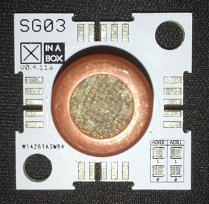

# ☒CHIP SG03

Library for SG03: Alcohol Sensor

## About the SG03
This ☒CHIP is equipped to detect alcohol vapor , just like your common breathalyzer. It has a high sensitivity and fast response time. Sensor provides an analog resistive output based on alcohol concentration. 

## Requirments
  - [☒Core Library](https://github.com/xinabox/xCore)
  - [Arduino IDE 1.8.1](https://www.arduino.cc/en/main/software)
  - ☒CHIP CWO1 or CC01 or CR01
  
## Installation Guide
To install the libraries please followed the guide provided on the [Arduino Website](https://www.arduino.cc/en/Guide/Libraries) under "**Importing a .zip Library**".
